# claude-familiar

A pixel companion for Claude Code. It sits above the prompt, reacts to what happens in the session, and grows as you work. Draw your own, or pick one from the lineup.

<p align="center">
  
</p>

<p align="center">
  
</p>

&nbsp;

## install

```sh
git clone https://github.com/lucenity0/claude-familiar ~/claude-familiar
claude --plugin-dir ~/claude-familiar
```

To load it in every session, set this in `~/.claude/settings.json`:

```json
{ "env": { "CLAUDE_CODE_PLUGIN_DIRS": "~/claude-familiar" } }
```

It uses function hooks, an early-access API, and was tested on Claude Code 2.1.287.

&nbsp;

## moods

```
working    thinking dots while Claude runs
happy      hops when failing tests pass again, or when you pet it
worried    a sweat drop through a run of failed commands
flinch     shakes when seatbelt blocks something
proud      sparkles after a turn longer than two minutes
sleepy     z's near a rate limit, or after ten quiet minutes
```

It gains xp from finished turns and fixed tests, and keeps it across sessions. Levels 5 and 10 earn a sparkle.

&nbsp;

## commands

```
/familiar                 show or hide it
/familiar pet             say hi
/familiar rename <name>
/familiar species         pick a look from the lineup
/familiar species <name>  clawd, cat, calico, sprout, owl, blob or custom
/familiar draw            a 16x12 pixel editor, one click per pixel
/familiar export          print the sprite as json
/familiar import <json>
/familiar ask [question]  what it thinks of the session
```

&nbsp;

## settings

Change these in `/config`, or in `~/.claude/settings.json`:

```json
{ "pluginConfigs": { "familiar@inline": { "options": { "size": "auto", "quips": false, "quipMinutes": 10 } } } }
```

`size` is `auto` (full while you read, half while Claude works), `full` or `compact`. Full size draws each pixel as a square of background color, so it has no gaps in any terminal. Compact uses half-block characters: Warp draws them cleanly, while Apple Terminal and VS Code can show thin seams between rows.

Everything runs locally at no token cost, except `ask` and quips. Quips are off by default; turned on, it reacts to a finished turn with one short Haiku line, at most once every `quipMinutes`.

&nbsp;

## sprites

The six above come built in, and `/familiar species` shows them in a pane to pick from.

A sprite is 16 by 12 pixels: a palette, and one string per row where `.` is empty. The `e` key is the eye; it shuts into a line when the familiar sleeps or flinches.

```json
{
  "palette": { "K": "#5c2626", "o": "#e8b660", "c": "#f0dcb0", "W": "#ffffff", "k": "#f6cfcf", "e": "#5c2626" },
  "rows": [
    "...KK......KK...",
    "..KooK....KccK..",
    ".KooooKKKKccccK.",
    "KooooooWWccccccK",
    "KoooooWWWWcccccK",
    "KoooeWWWWWWecccK",
    "KWkkeWWWWWWekkWK",
    "KWWWWWWWWWWWWWWK",
    "KWKKKWWWWWWKKKWK",
    ".KccWKKKKKKWccK.",
    ".KWWWK....KWWWK.",
    "..KKK......KKK.."
  ]
}
```

`/familiar export` prints this for your familiar, and `/familiar import` loads one someone shared.

&nbsp;

## contributing

Made a familiar you like? Open an issue with its export, or add it as a species: its sprite goes in [`sprites.ts`](hooks/sprites.ts), its pet lines in [`mood.ts`](hooks/mood.ts), and its names in [`register.tsx`](hooks/register.tsx).

```sh
claude plugin validate .
claude plugin test .
```

The default sprite is Clawd, Claude Code's own mascot, recreated here rather than original art.

&nbsp;

---

<sub>MIT · built with Claude Code</sub>
